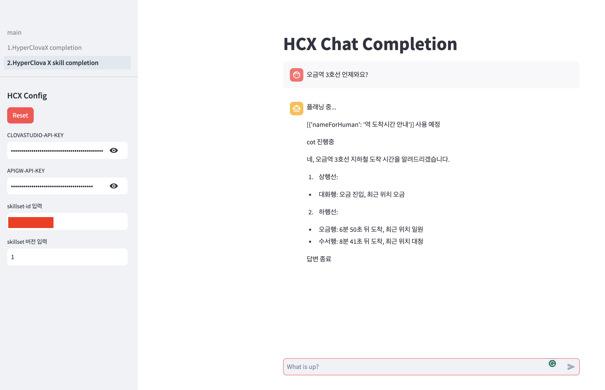

# HyperClova X 인퍼런스를 위한 테스트 도구

## 1. Playground
모델을 선택하여 간단한 대화 테스트 가능

### 1. HyperClova X Chat completion
TBH

<br>

### 2. HyperClova X Skill completion
HyperClova X studio와 동일하게 Skill 테스트 가능


#### 실행 방법
```bash
## venv 환경 실행
$ python3 -m venv .venv
$ . .venv/bin/activate

## 의존성 설치
(.venv)$ pip install -r requirements.txt

## streamlit 실행
(.venv)$ streamlit run main.py
```

<br>

## 3. 대화 자동 비교
TBH

<br>

## 4. RAG
TBH